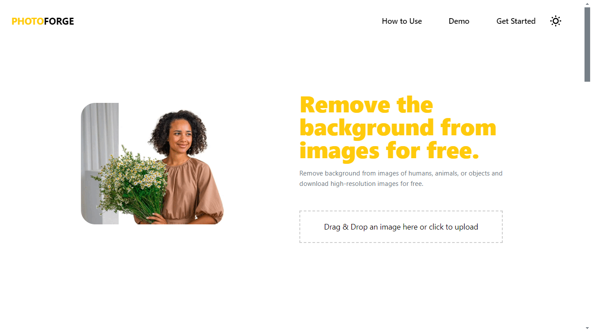
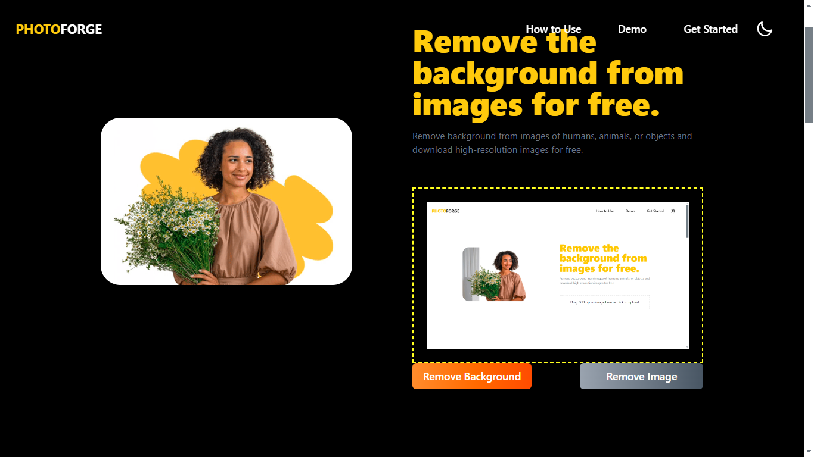
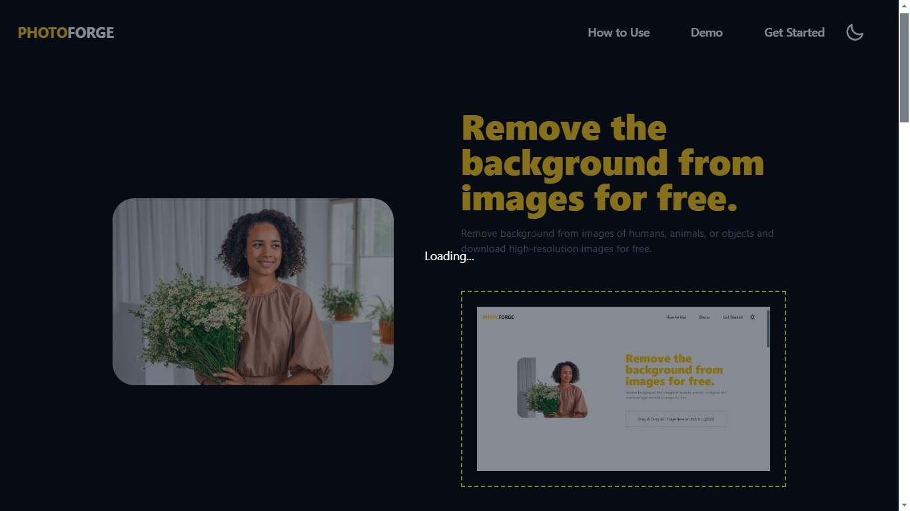

# PhotoForge

**PhotoForge** is an easy-to-use background removal web application created using **React.js**. It allows users to remove backgrounds from their images with a simple drag-and-drop feature, powered by the **remove.bg** API. This project is deployed on **Vercel** for quick and smooth accessibility.

![Logo]  <!-- Optional logo or header image -->

## Features

- **Drag and Drop**: Effortlessly upload images using a drag-and-drop interface.
- **Background Removal**: Automatically removes image backgrounds using the remove.bg API.
- **User-Friendly Interface**: Clean, responsive UI built with React.
- **Real-Time Processing**: Displays the image with a removed background in seconds.
- **Image Preview**: Shows a preview of the uploaded image before processing.
- **Download Options**: Easily download the processed image in high quality.
- **Fast Deployment**: Hosted on Vercel for seamless and reliable performance.

## Live Demo

Check out the live demo: [PhotoForge](https://photoforge.vercel.app/)

## Screenshots

### Uploading an Image

![Uploading Image]

### Processing the Image

### Result Display 

## Technologies Used

- **React.js**: Frontend framework for building a dynamic and responsive user interface.

- **Vercel**: Hosting platform for fast and scalable deployment.

## How to Use

1. Open the BGSTRIP web application in your browser.
2. Click on the "Upload Image" button to select an image from your device.
3. Once the image is uploaded, click on the "Remove Background" button to initiate the background removal process.
4. Wait for the process to complete. The time taken may vary depending on the image size and complexity.
5. Once the background is removed, you can preview the edited image.
6. If you are satisfied with the result, click on the "Download" button to save the edited image to your device.
7. You can repeat the process with different images as needed.
